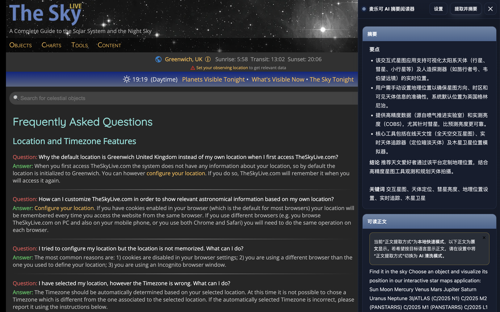
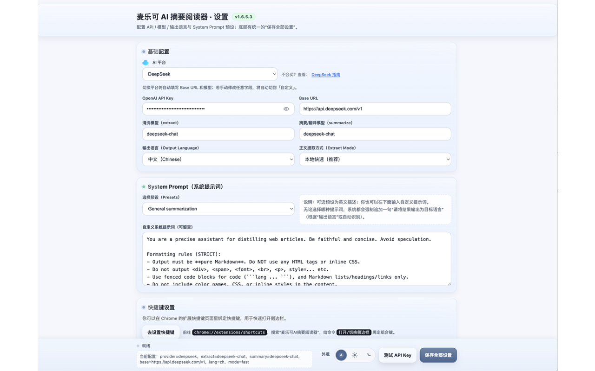
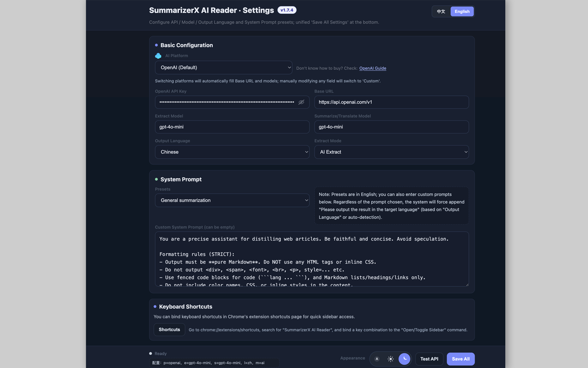
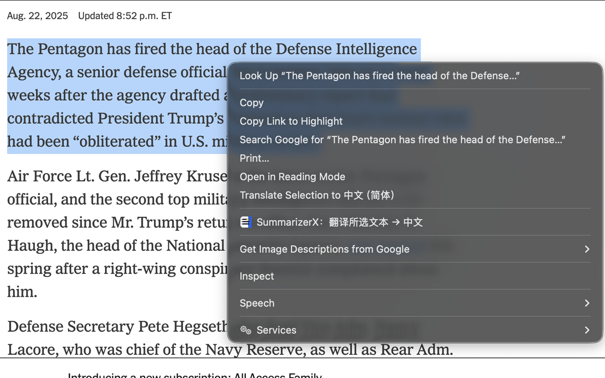
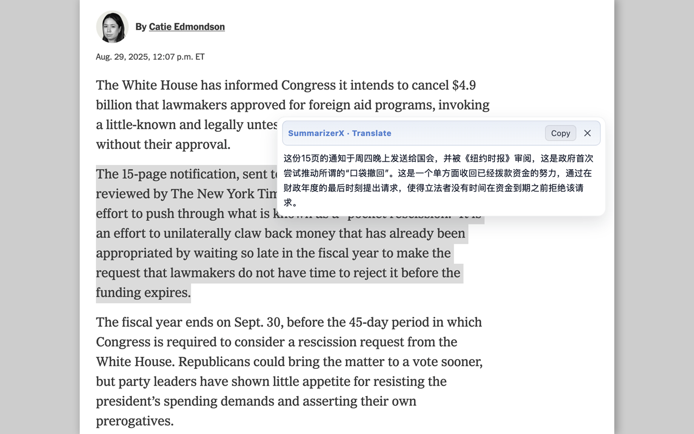

# Summary

[](LICENSE)

---

## English

**Summary** is a Chrome extension that helps you quickly extract, summarize, and translate webpage content with AI-powered enhancements. It offers a clean reading experience with customizable settings and a floating panel.

### ✨ Features

- 📰 Clean Content Extraction: Remove ads, navigation, and clutter for focused reading  
- 🤖 AI-Powered Summarization & Translation: Generate concise summaries or translations in one click  
- ⚙️ Customizable Settings: Adjust prompts, modes, shortcuts, and UI preferences  
- 📑 Floating Panel: View summaries without leaving the current page  
- 🌙 Theming Support: Light and dark modes for comfortable reading  
- 🖱️ Context Menu Translate: Right-click on selected text and instantly translate it with AI

### 🖼 Screenshots

<p align="center">
  
</p>
<p align="center">
  
</p>
<p align="center">
  
</p>
<p align="center">
  
</p>
<p align="center">
  
</p>
<p align="center">
  
</p>

### 🚀 Installation

1. Clone the repository:  
   ```bash
   git clone https://github.com/mallocfeng/SummarizerX.git
   ```
2. Open Chrome extensions page: `chrome://extensions/`  
3. Enable **Developer Mode**  
4. Click **Load unpacked** and select the project folder  

> Note: Do not load ZIP files directly; unzip first.

### ⚡ Quick Start

- Click the **Summary** icon in the toolbar to open the floating panel  
- Select text or let it auto-extract the main content  
- Choose summarize or translate options  
- Customize prompts and modes in settings  
- Use the new **right-click menu** to translate selected text instantly

### ⚙️ Settings Reference

- **Prompt templates:** Customize AI instructions  
- **Default mode:** Summarize, translate, or AI rewrite  
- **Keyboard shortcuts:** Configure quick actions  
- **Theme:** Light or dark mode  

### 🎨 Theming

Supports light and dark themes to reduce eye strain and match your browser preferences.

### 🔒 Privacy

All processing happens locally or via your configured AI API key. No data is sent to third parties without your consent.

### 🛠 Troubleshooting

- If extraction fails, try selecting text manually  
- Reload the extension or browser if UI glitches occur  
- Check console logs for errors in developer tools  

### 📌 Roadmap

- [ ] Dark mode improvements  
- [ ] Export summaries to Markdown and PDF  
- [ ] Multi-language UI support  

---

## 中文简介

**Summary** 是一款 Chrome 浏览器扩展，利用 AI 技术快速提取、摘要和翻译网页内容，提供简洁流畅的阅读体验和丰富的个性化设置，支持浮动面板查看摘要。

### ✨ 功能亮点

- 📰 干净的内容提取：去除广告、导航和杂乱内容，专注阅读  
- 🤖 AI 驱动的摘要与翻译：一键生成简洁摘要或翻译  
- ⚙️ 个性化设置：自定义提示词、模式、快捷键和界面偏好  
- 📑 浮动面板：无需跳转页面即可查看摘要  
- 🌙 主题支持：明亮和暗黑模式，保护视力  
- 🖱️ 右键菜单翻译：在网页中选中文本，右键即可快速调用 AI 翻译

### 🖼 软件截图

<p align="center">
  
</p>
<p align="center">
  
</p>
<p align="center">
  
</p>
<p align="center">
  
</p>
<p align="center">
  
</p>
<p align="center">
  
</p>

### 🚀 安装方法

1. 克隆仓库：  
   ```bash
   git clone https://github.com/mallocfeng/SummarizerX.git
   ```
2. 打开 Chrome 扩展页面：`chrome://extensions/`  
3. 启用 **开发者模式**  
4. 点击 **加载已解压的扩展程序**，选择项目文件夹  

> 注意：请先解压，不要直接加载 ZIP 文件。

### ⚡ 快速开始

- 点击工具栏中的 **Summary** 图标，打开浮动面板  
- 选中文本或自动提取正文  
- 选择摘要或翻译功能  
- 在设置中自定义提示词和模式  
- 使用新增的 **右键菜单翻译** 功能，立即翻译所选文本

### ⚙️ 设置说明

- **提示词模板：** 自定义 AI 指令  
- **默认模式：** 摘要、翻译或 AI 重写  
- **快捷键：** 配置快速操作  
- **主题：** 明亮或暗黑模式  

### 🎨 主题支持

支持明亮和暗黑主题，减少眼睛疲劳，适配浏览器偏好。

### 🔒 隐私说明

所有处理均在本地或通过您配置的 AI API 密钥完成，未经允许不会发送数据给第三方。

### 🛠 常见问题

- 提取失败时，尝试手动选中文本  
- UI 异常时，重启扩展或浏览器  
- 使用开发者工具查看控制台日志排查错误  

### 📌 开发计划

- [ ] 优化暗黑模式  
- [ ] 支持导出 Markdown 和 PDF  
- [ ] 多语言界面支持  

---

## 📜 License

MIT License © 2025 [Malloc Feng](https://github.com/mallocfeng)