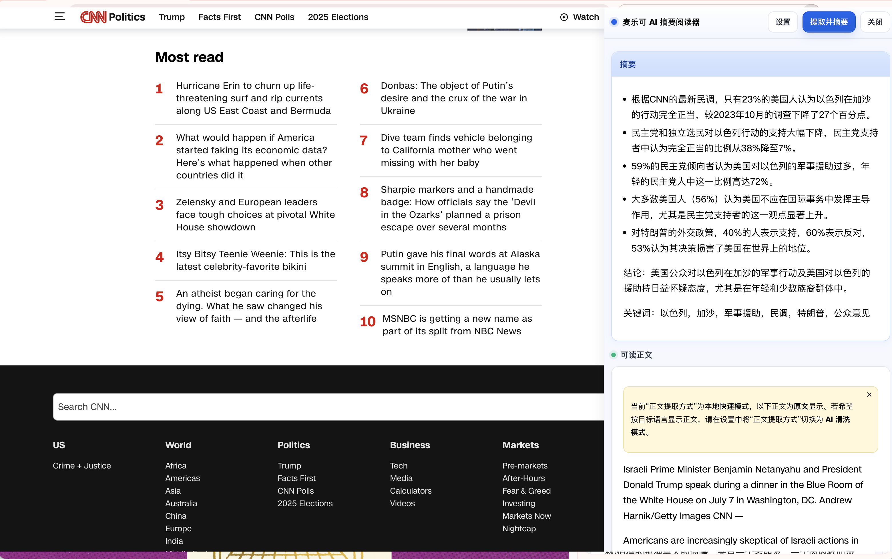
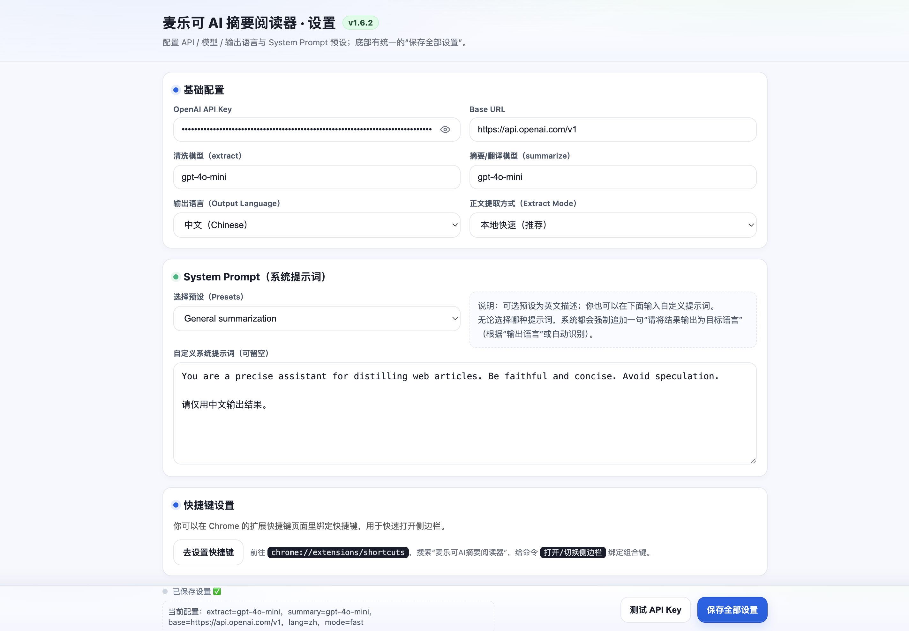

# SummarizerX / 麦乐可 AI 摘要阅读器

[](LICENSE)

🌐 [English](#english) | [中文](#中文简介)

---

## English

**SummarizerX** is a Chrome extension that extracts the main content of webpages and generates **summaries** or **translations**.  
It now comes with a **refined architecture**, improved readability, and unified UI design.

### ✨ Features
- 📰 **Readable Content Extraction** — filter out ads, navigation, and clutter  
- 🤖 **AI Enhanced Mode** — rewrite content for smoother, more natural reading  
- 📝 **Summarization & Translation** — get quick overviews or translations in one click  
- ⚙️ **Customizable Settings** — configure prompts, modes, shortcuts, and more  
- 📑 **Floating Panel UI** — read summaries directly without leaving your page  




### 🚀 Installation
1. Clone this repo:  
   ```bash
   git clone https://github.com/mallocfeng/SummarizerX.git
   ```
2. Open **Chrome Extensions** page: `chrome://extensions/`  
3. Enable **Developer Mode**  
4. Click **Load unpacked** → select the **project folder** (unzipped)  

👉 Note: You **cannot** install by directly dragging a ZIP file. Please extract the folder first.

### ⌨️ Shortcuts
Set custom shortcuts at:  
`chrome://extensions/shortcuts`

### 📌 Roadmap
- [ ] Dark mode support  
- [ ] Export summaries to Markdown / PDF  
- [ ] Multi-language UI  

---

## 中文简介

**麦乐可 AI 摘要阅读器（SummarizerX）** 是一款 Chrome 浏览器扩展，能够提取网页主要内容，并生成 **摘要** 或 **翻译**。  
软件已全面重构，界面与设置页保持一致，阅读体验更加自然流畅。

### ✨ 功能特点
- 📰 **正文提取** —— 自动过滤广告、导航栏、杂项内容  
- 🤖 **AI 增强模式** —— 智能优化文字，让阅读更顺畅  
- 📝 **摘要与翻译** —— 一键获取摘要或翻译成目标语言  
- ⚙️ **个性化设置** —— 可自定义 Prompt、默认模式、快捷键等  
- 📑 **浮动侧栏面板** —— 不跳转页面即可查看摘要  


### 🚀 安装方法
1. 克隆仓库：  
   ```bash
   git clone https://github.com/mallocfeng/SummarizerX.git
   ```
2. 打开 **Chrome 扩展管理页面**：`chrome://extensions/`  
3. 启用 **开发者模式**  
4. 点击 **加载已解压的扩展程序** → 选择项目文件夹  

👉 注意：不能直接加载 ZIP 文件，必须先解压再选择文件夹。

### ⌨️ 快捷键
可在以下页面设置快捷键：  
`chrome://extensions/shortcuts`

### 📌 开发计划
- [ ] 支持暗黑模式  
- [ ] 支持导出 Markdown / PDF  
- [ ] 支持多语言界面  

---

## 📜 License
MIT License © 2025 [Malloc Feng](https://github.com/mallocfeng)