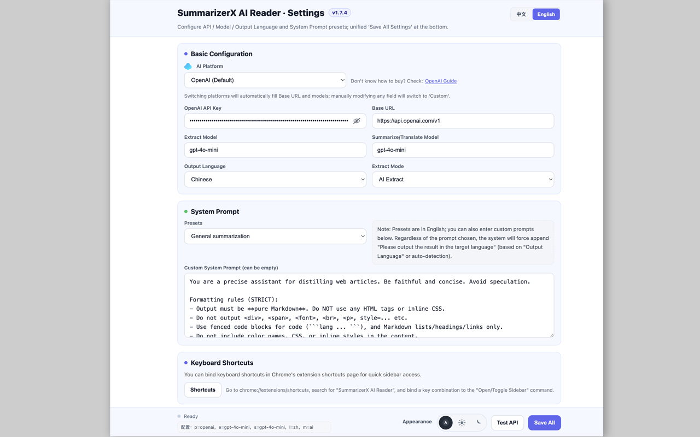

# Summary

[](LICENSE)

---

## English

**Summary** is a Chrome extension that helps you quickly extract, summarize, and translate webpage content with AI-powered enhancements. It offers a clean reading experience with customizable settings and a floating panel.

### ✨ Features

- 📰 Clean Content Extraction: Remove ads, navigation, and clutter for focused reading  
- 🤖 AI-Powered Summarization & Translation: Generate concise summaries or translations in one click  
- ⚙️ Customizable Settings: Adjust prompts, modes, shortcuts, and UI preferences  
- 📑 Floating Panel: View summaries without leaving the current page  
- 🌙 Theming Support: Light and dark modes for comfortable reading  
- 🖱️ Context Menu Translate: Right-click on selected text and instantly translate it with AI

### 🖼 Screenshots

<p align="center">
  
</p>
<p align="center">
  
</p>
<p align="center">
  
</p>
<p align="center">
  
</p>
<p align="center">
  
</p>
<p align="center">
  
</p>

### 🚀 Installation

1. Clone the repository:  
   ```bash
   git clone https://github.com/mallocfeng/SummarizerX.git
   ```
2. Open Chrome extensions page: `chrome://extensions/`  
3. Enable **Developer Mode**  
4. Click **Load unpacked** and select the project folder  

> Note: Do not load ZIP files directly; unzip first.

### ⚡ Quick Start

- Click the **Summary** icon in the toolbar to open the floating panel  
- Select text or let it auto-extract the main content  
- Choose summarize or translate options  
- Customize prompts and modes in settings  
- Use the new **right-click menu** to translate selected text instantly

### ⚙️ Settings Reference

- **Prompt templates:** Customize AI instructions  
- **Default mode:** Summarize, translate, or AI rewrite  
- **Keyboard shortcuts:** Configure quick actions  
- **Theme:** Light or dark mode  

### 🎨 Theming

Supports light and dark themes to reduce eye strain and match your browser preferences.

### 🔒 Privacy

All processing happens locally or via your configured AI API key. No data is sent to third parties without your consent.

### 🛠 Troubleshooting

- If extraction fails, try selecting text manually  
- Reload the extension or browser if UI glitches occur  
- Check console logs for errors in developer tools  

### 📌 Roadmap

- [ ] Dark mode improvements  
- [ ] Export summaries to Markdown and PDF  
- [ ] Multi-language UI support  

---

## 中文简介

**Summary** 是一款 Chrome 浏览器扩展，利用 AI 技术快速提取、摘要和翻译网页内容，提供简洁流畅的阅读体验和丰富的个性化设置，支持浮动面板查看摘要。

### ✨ 功能亮点

- 📰 干净的内容提取：去除广告、导航和杂乱内容，专注阅读  
- 🤖 AI 驱动的摘要与翻译：一键生成简洁摘要或翻译  
- ⚙️ 个性化设置：自定义提示词、模式、快捷键和界面偏好  
- 📑 浮动面板：无需跳转页面即可查看摘要  
- 🌙 主题支持：明亮和暗黑模式，保护视力  
- 🖱️ 右键菜单翻译：在网页中选中文本，右键即可快速调用 AI 翻译

### 🖼 软件截图

<p align="center">
  
</p>
<p align="center">
  
</p>
<p align="center">
  
</p>
<p align="center">
  
</p>
<p align="center">
  
</p>
<p align="center">
  
</p>

### 🚀 安装方法

1. 克隆仓库：  
   ```bash
   git clone https://github.com/mallocfeng/SummarizerX.git
   ```
2. 打开 Chrome 扩展页面：`chrome://extensions/`  
3. 启用 **开发者模式**  
4. 点击 **加载已解压的扩展程序**，选择项目文件夹  

> 注意：请先解压，不要直接加载 ZIP 文件。

### ⚡ 快速开始

- 点击工具栏中的 **Summary** 图标，打开浮动面板  
- 选中文本或自动提取正文  
- 选择摘要或翻译功能  
- 在设置中自定义提示词和模式  
- 使用新增的 **右键菜单翻译** 功能，立即翻译所选文本

### ⚙️ 设置说明

- **提示词模板：** 自定义 AI 指令  
- **默认模式：** 摘要、翻译或 AI 重写  
- **快捷键：** 配置快速操作  
- **主题：** 明亮或暗黑模式  

### 🎨 主题支持

支持明亮和暗黑主题，减少眼睛疲劳，适配浏览器偏好。

### 🔒 隐私说明

所有处理均在本地或通过您配置的 AI API 密钥完成，未经允许不会发送数据给第三方。

### 🛠 常见问题

- 提取失败时，尝试手动选中文本  
- UI 异常时，重启扩展或浏览器  
- 使用开发者工具查看控制台日志排查错误  

### 📌 开发计划

- [ ] 优化暗黑模式  
- [ ] 支持导出 Markdown 和 PDF  
- [ ] 多语言界面支持  

---

## 🌍 Internationalization (i18n)

**SummarizerX AI Reader** now supports bilingual interface (Chinese & English). Users can switch language in settings and all UI text will update instantly.

### ✨ Features
- **中文（默认）**：完整的中文界面  
- **English**：full English UI  
- **Realtime switching**：no restart required, changes take effect immediately

### 🎨 Coverage
- ✅ Settings page (options.html)  
- ✅ Floating panel (float_panel.js)  
- ✅ Translation bubble (selection_translate.js)  
- ✅ Extension icon title  
- ✅ Error and status messages  

### 🚀 How to Use
1. Open the extension settings page  
2. Find the language switcher at the top (中文 / English)  
3. Click to switch instantly  

Language choice is saved in `chrome.storage.sync` and will be remembered next time.

### 🛠 Technical Details
- **i18n.js**: centralized bilingual config  
- **Functions**: `getCurrentLanguage()`, `t()`, `tSync()`, `updatePageLanguage()`  
- **Flow**: save → update language attribute → re-render UI

#### 📂 File layout (i18n related)
```
├── i18n.js              # Central translation config and helpers
├── options.html         # Settings page (language switcher in header)
├── options.js           # Applies UI texts via t()/tSync(); persists ui_language
├── float_panel.js       # Floating panel texts follow selected UI language
├── selection_translate.js # Copy/close labels and bubble title localized
└── manifest.json        # Action title localized (static fallback)
```

#### ➕ Add new texts
1) Add keys in `i18n.js` under both `zh` and `en` (e.g. `mySection.myKey`).  
2) Read them in code with `await t('mySection.myKey')` (or `tSync('mySection.myKey','en')`).  
3) Update UI by setting `element.textContent = ...`.

Example:
```javascript
// i18n.js
zh: { mySection: { hello: "你好" } },
en: { mySection: { hello: "Hello" } }

// usage
titleEl.textContent = await t('mySection.hello');
```

#### 🧪 Troubleshooting (i18n)
- Text not updating: ensure element IDs exist and `updateUIText()` runs after DOM ready.  
- Wrong language: check `chrome.storage.sync.get('ui_language')`.  
- Import error in content scripts: make sure `chrome.runtime.getURL('i18n.js')` is used for dynamic import.

### 📌 Changelog v1.6.8
- 🎨 Inline translation blocks follow theme with correct light background (opaque)  
- 🔄 Theme sync between settings page and floating panel is instantaneous  
- 🐞 Fixed context menu title instant toggle after full-page translate/restore  
- 🧼 Minor CSS refinements on settings footer alignment and meta text area  

---

## 🌍 国际化支持

**SummarizerX AI Reader** 现已支持中英文双语界面。用户可以在设置页面切换语言，界面文本会即时更新。

### ✨ 功能特性
- **中文（默认）**：完整的中文界面  
- **English**：完整的英文界面  
- **实时切换**：无需重启扩展，立即生效  

### 🎨 覆盖范围
- ✅ 设置页面（options.html）  
- ✅ 浮窗面板（float_panel.js）  
- ✅ 翻译气泡（selection_translate.js）  
- ✅ 扩展图标标题  
- ✅ 错误提示和状态信息  

### 🚀 使用方法
1. 打开扩展设置页面  
2. 在页面顶部找到语言切换器（中文 / English）  
3. 点击即可切换  

语言选择会保存到 `chrome.storage.sync`，下次会自动记住。

### 🛠 技术说明
- **i18n.js**：集中管理的双语配置文件  
- **主要函数**：`getCurrentLanguage()`、`t()`、`tSync()`、`updatePageLanguage()`  
- **流程**：保存设置 → 更新语言属性 → 重新渲染界面  

#### 📂 相关文件结构（i18n）
```
├── i18n.js              # 翻译配置与工具函数
├── options.html         # 设置页（顶部语言切换器）
├── options.js           # 通过 t()/tSync() 应用文本；保存 ui_language
├── float_panel.js       # 浮窗面板文案随 UI 语言切换
├── selection_translate.js # 复制/关闭按钮与标题本地化
└── manifest.json        # 扩展图标标题（静态兜底）
```

#### ➕ 添加新文案
1）在 `i18n.js` 同时增加 `zh` 与 `en` 的键值（如 `mySection.myKey`）。  
2）代码里用 `await t('mySection.myKey')`（或 `tSync('mySection.myKey','zh')`）读取。  
3）更新 UI：如 `el.textContent = ...`。

示例：
```javascript
// i18n.js
zh: { mySection: { hello: "你好" } },
en: { mySection: { hello: "Hello" } }

// 使用
titleEl.textContent = await t('mySection.hello');
```

#### 🧪 常见问题（i18n）
- 文案不更新：确认元素 ID 正确、`updateUIText()` 在 DOM Ready 后执行。  
- 语言不对：检查 `chrome.storage.sync.get('ui_language')`。  
- 动态导入报错：内容脚本里使用 `chrome.runtime.getURL('i18n.js')` 进行导入。

### 📌 更新日志 v1.6.8
- 🎨 内联翻译引用块在亮色模式使用不透明浅灰底，深色文字  
- 🔄 设置页与浮窗的主题切换实现双向实时联动  
- 🐞 全文翻译与显示原文的右键菜单标题即刻切换  
- 🧼 设置页底部对齐与 meta 文本区样式小幅优化  

---

## 📜 License

MIT License © 2025 [Malloc Feng](https://github.com/mallocfeng)