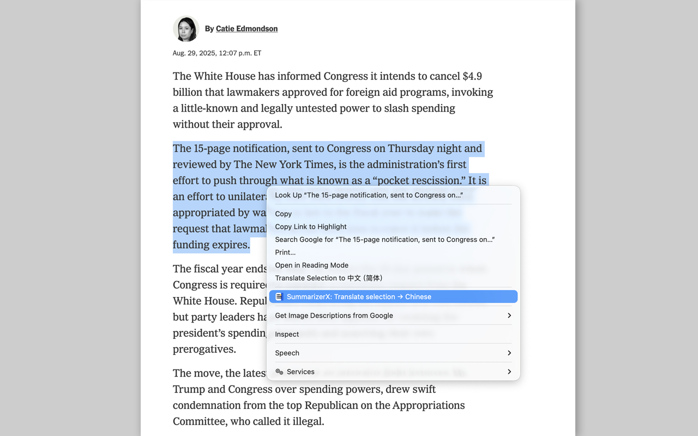
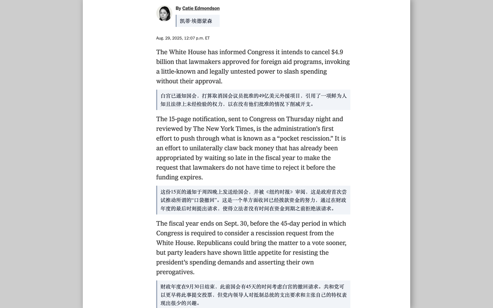

# Summary

[](LICENSE)

### Chrome Web Store / 官方页面

- English: Get it on the Chrome Web Store → <a href="https://chromewebstore.google.com/detail/summarizerx-ai-reader/okpefajonbfdnojdmobecjdajcohhoje?hl=en&authuser=0" target="_blank" rel="noopener noreferrer">SummarizerX AI Reader</a>
  - If you find it helpful, please consider leaving a **5-star review** — thank you!
- 中文：从 Chrome 应用商店安装 → <a href="https://chromewebstore.google.com/detail/summarizerx-ai-reader/okpefajonbfdnojdmobecjdajcohhoje?hl=en&authuser=0" target="_blank" rel="noopener noreferrer">SummarizerX AI Reader（官方页面）</a>
  - 如果觉得好用，诚邀给我们一个**五星好评**，非常感谢！

---

## English

Current stable: v1.9.1 (main branch)
Current beta: v2.2.0-beta (dev/next branch)

**Summary** is a Chrome extension that helps you quickly extract, summarize, and translate webpage content with AI-powered enhancements. It offers a clean reading experience with customizable settings and a floating panel.

### ✨ Features

- 📰 Clean Content Extraction: Remove ads, navigation, and clutter for focused reading  
- 🤖 AI-Powered Summarization & Translation: Generate concise summaries or translations in one click  
- ⚙️ Customizable Settings: Adjust prompts, modes, shortcuts, and UI preferences  
- 📑 Floating Panel: View summaries without leaving the current page  
- 🌙 Theming Support: Light and dark modes for comfortable reading  
- 🖱️ Context Menu Translate: Right-click on selected text and instantly translate it with AI
 - 🧾 Full Page Translate: Translate the entire visible page; show translations inline as quote blocks under the originals, and toggle via context menu (Translate full page / Show original)
 - 🌍 Bilingual UI (中文/English): Switch in settings; all UI texts update instantly
 - 💬 Page Q&A Chat (beta): Ask about the current page via a bubble chat UI (user right, AI left) with a typing indicator and tidy Markdown answers; smart scrolling aligns long answers to the top, short answers scroll to bottom
 - 🔍 Inline Translate Zoom (beta): Per-paragraph +/- zoom for long quote blocks, controls pinned at the top-right with hover lift; text never overlaps controls
- ⚡ Vue.js Integration: Modern reactive UI with improved performance and user experience
- 🎯 Smart Layout Alignment: Intelligent positioning for full-page translations that adapts to complex website layouts (CSS Grid, responsive design)
- 🌙 Force Dark Mode: Toggle to force dark mode on any webpage with optimized text colors for better readability
 - ✅ Consistent Consent Pulse: Trial consent attention “breathing” animation now behaves the same in light and dark themes
- 🛡️ Ad Filtering (ABP 2.0 cosmetic): Enable in Settings → 广告过滤 (now below System Prompt). Choose global/regional lists (EasyList, EasyPrivacy, Fanboy’s, etc.) and the new Cookie Notice Hiding category (EasyList Cookie General Hide). Per‑list sync, Low/Medium/High strength, and auto-sync on selection (checked lists download immediately). Rules are stored locally and applied per‑host.
  - 🧰 Element Hiding Picker (beta): In the floating panel footer, click “Hide element”, then click any element to create a per-domain cosmetic rule; Confirm exits the picker; Cancel continues; press Esc to exit. The picker hides all matches on the current page immediately, and saves the rule under Settings → Ad Filtering → Custom hides. Tip: Medium strength is recommended when using custom/user rules.
  - ▶️ Video ads (beta, site packs): NYTimes + CNN/Reuters/Bloomberg/Guardian/Yahoo/CNET — use session-scoped DNR to redirect specific ad modules (e.g., Betamax ads, IMA3) to safe stubs and block FreeWheel/GPT/Amazon/Media.net with initiator scoping to avoid side effects. Rules load only while a tab of the site is open.
  - 🗂 Settings tabs: Top tabs (AI Summary / Ad Filtering) for clearer navigation; polished tab visuals, gradient underline, and unified header/card background.
  - 🧩 NYTimes: optional toggle to hide the “Family subscriptions / All Access Family” upsell popup (off by default for fresh installs). Adblock main switch and popup blocker are also off by default on first install.
  - ℹ️ Safety: Avoid collapsing ChatGPT/OpenAI sticky UI when cleaning floating overlays

### 🖼 Screenshots

<p align="center">
  
</p>
<p align="center">
  
</p>
<p align="center">
  
</p>
<p align="center">
  
</p>
<p align="center">
  
</p>
<p align="center">
  
</p>
<p align="center">
  
</p>

### 🚀 Installation

1. Clone the repository:  
   ```bash
   git clone https://github.com/mallocfeng/SummarizerX.git
   ```
2. Open Chrome extensions page: `chrome://extensions/`  
3. Enable **Developer Mode**  
4. Click **Load unpacked** and select the project folder  

> Note: Do not load ZIP files directly; unzip first.

### ⚡ Quick Start

- Click the **Summary** icon in the toolbar to open the floating panel  
- Select text or let it auto-extract the main content  
- Choose summarize or translate options  
- Customize prompts and modes in settings  
- Use the new **right-click menu** to translate selected text instantly
 - Use **Translate full page** from the right-click menu to insert translations below each paragraph as quote blocks; switch back via **Show original**

### ⚙️ Settings Reference

- **Prompt templates:** Customize AI instructions  
- **Default mode:** Summarize, translate, or AI rewrite  
- **Keyboard shortcuts:** Configure quick actions  
- **Theme:** Light or dark mode  

### 🎨 Theming

Supports light and dark themes to reduce eye strain and match your browser preferences.

### 🔒 Privacy

All processing happens locally or via your configured AI API key. No data is sent to third parties without your consent.

### 🛠 Troubleshooting

- If extraction fails, try selecting text manually  
- Reload the extension or browser if UI glitches occur  
- Check console logs for errors in developer tools  

### 🧭 Translation Mode — Output Rules

- **English**: In translation mode, AI outputs plain text only. No Markdown, no quotes, no extra commentary. Preserve paragraph breaks.
- **中文**：翻译模式下严格输出纯文本；不包含 Markdown/引号/额外说明，保持原段落换行。

## 中文简介

当前稳定版：v1.9.1 (main分支)
当前测试版：v2.0.6 (dev/next分支)

**Summary** 是一款 Chrome 浏览器扩展，利用 AI 技术快速提取、摘要和翻译网页内容，提供简洁流畅的阅读体验和丰富的个性化设置，支持浮动面板查看摘要。

### ✨ 功能亮点

- 📰 干净的内容提取：去除广告、导航和杂乱内容，专注阅读  
- 🤖 AI 驱动的摘要与翻译：一键生成简洁摘要或翻译  
- ⚙️ 个性化设置：自定义提示词、模式、快捷键和界面偏好  
- 📑 浮动面板：无需跳转页面即可查看摘要  
- 🌙 主题支持：明亮和暗黑模式，保护视力  
- 🖱️ 右键菜单翻译：在网页中选中文本，右键即可快速调用 AI 翻译
 - 🧾 全文翻译：将整页可见内容按段落翻译，在原文下方以引用块内联展示；可在右键菜单“全文翻译 / 显示原文”间切换  
 - 🌍 双语界面（中文/English）：设置页可切换语言，界面文案即时更新
 - ⚡ Vue.js 集成：现代化响应式界面，提升性能和用户体验
 - 🎯 智能布局对齐：全文翻译智能定位，适配复杂网站布局（CSS Grid、响应式设计）
- 🌙 强制深色模式：开关控制强制任何网页开启深色模式，优化文字颜色确保可读性
 - ✅ 试用同意提示一致：需要同意时的“呼吸”动画在明亮/暗黑主题下表现一致
- 🛡️ 广告过滤（ABP 2.0 元素隐藏）：在设置 → 广告过滤（现位于“系统提示词”下方）开启；可选全球/区域列表（EasyList、EasyPrivacy、Fanboy’s等）和“Cookie 提示隐藏”分类（内置 EasyList Cookie General Hide）。支持单条规则“同步更新”、勾选后自动同步、高/中/低强度；规则本地保存，并按站点应用以隐藏/去除广告元素。
  - 🧰 隐藏元素选择器（测试版）：在浮窗底部点击“隐藏元素”，再点击页面中的元素即可生成“按域名”的外观隐藏规则；“确认添加”会立即退出选择模式并隐藏当前页所有匹配元素；“取消”继续选择；按 Esc 退出。规则保存在 设置 → 广告过滤 → 自定义隐藏。提示：使用自定义/用户规则时，建议将过滤强度设为“中”。
  - ▶️ 视频广告（测试版，站点包）：NYTimes + CNN/路透/彭博/卫报/Yahoo/CNET — 使用“会话规则（DNR）”在仅打开目标站点时重定向特定广告模块（如 Betamax ads、IMA3）到安全空实现，并按站点限定阻断 FreeWheel/GPT/Amazon/Media.net，降低副作用。
  - 🗂 设置页标签：新增顶部标签（AI 摘要 / 广告过滤）与样式优化；保留渐变下划线并与首张卡片上浮联动；统一标题栏/卡片色调，视觉更自然。

### 🖼 软件截图

<p align="center">
  
</p>
<p align="center">
  
</p>
<p align="center">
  
</p>
<p align="center">
  
</p>
<p align="center">
  
</p>
<p align="center">
  
</p>
<p align="center">
  
</p>


### 🚀 安装方法

1. 克隆仓库：  
   ```bash
   git clone https://github.com/mallocfeng/SummarizerX.git
   ```
2. 打开 Chrome 扩展页面：`chrome://extensions/`  
3. 启用 **开发者模式**  
4. 点击 **加载已解压的扩展程序**，选择项目文件夹  

> 注意：请先解压，不要直接加载 ZIP 文件。

### ⚡ 快速开始

- 点击工具栏中的 **Summary** 图标，打开浮动面板  
- 选中文本或自动提取正文  
- 选择摘要或翻译功能  
- 在设置中自定义提示词和模式  
- 使用新增的 **右键菜单翻译** 功能，立即翻译所选文本
 - 在网页空白处右键选择 **全文翻译**，系统会在每段原文下方插入引用块译文；需要恢复时选择 **显示原文**
 - 使用 **全文翻译** 右键菜单，在原文下方以引用块展示译文，并可在“全文翻译 / 显示原文”间切换

### ⚙️ 设置说明

- **提示词模板：** 自定义 AI 指令  
- **默认模式：** 摘要、翻译或 AI 重写  
- **快捷键：** 配置快速操作  
- **主题：** 明亮或暗黑模式  

### 🎨 主题支持

支持明亮和暗黑主题，减少眼睛疲劳，适配浏览器偏好。

### 🔒 隐私说明

所有处理均在本地或通过您配置的 AI API 密钥完成，未经允许不会发送数据给第三方。

### 🛠 常见问题

- 提取失败时，尝试手动选中文本  
- UI 异常时，重启扩展或浏览器  
- 使用开发者工具查看控制台日志排查错误  

### 🧭 翻译模式输出规则

- **中文**：翻译模式下严格输出纯文本；不包含 Markdown/引号/额外说明，保持原段落换行。
- **English**: In translation mode, AI outputs plain text only. No Markdown, no quotes, no extra commentary. Preserve paragraph breaks.


## 📜 License

MIT License © 2025 [Malloc Feng](https://github.com/mallocfeng)
